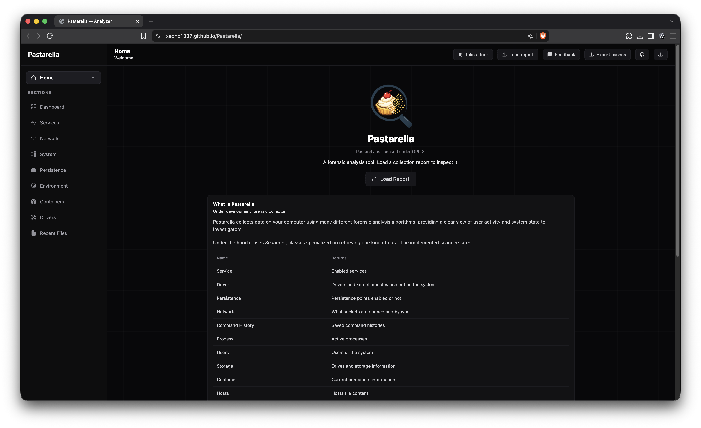

<div align="center">
  
  <h1>Pastarella</h1>
</div>

<h4 align="center">A forensic analysis tool written in C#.</h4>

Pastarella is an **under development** tool designed to collect data in your computer by using many different forensic analysis algorithms, providing a clear view of the user activity and system state to the investigators.

---

## Web Preview



---

## Support

Pastarella is still in development, and it currently supports:

- Windows
- macOS
- Linux (WIP)
- FreeBSD (very WIP)

For further information click [here](https://xecho1337.github.io/Pastarella).

## Installing

If you want to use Pastarella you can just go to [releases](https://github.com/xEcho1337/Pastarella/releases) and download the right artifact for
your operating system. No further installation required!

### Source

Instead if you want to build yourself the project you just need to clone the repository, get the submodules
and run `dotnet build`.
Ready-to-go commands:

```sh
$ git clone --recurse-submodules https://github.com/xEcho1337/Pastarella.git
$ cd Pastarella
# Build a release artifact
# `YOUR-RID` is the combo `OS-ARCH`. OS can be `win` (Windows), `osx` (MacOS), `linux` or `freebsd`.
$ cd src/Pastarella; dotnet build -c Release -r <YOUR-RID> -o ../../out/
```

## The name

Pastarella can mean different things depending on what you like the most:

- an Italian way to say "pastry": if you feel hungry
- Postmortem Analysis of System Telemetry, Artifacts, Registry, Events, Logs, Links and Activity: if you feel creative
- a delicious forensic framework: if you ask the marketing team
- just a pastry: if you ask my grandmother

## License

Pastarella is licensed under GPL-3.
